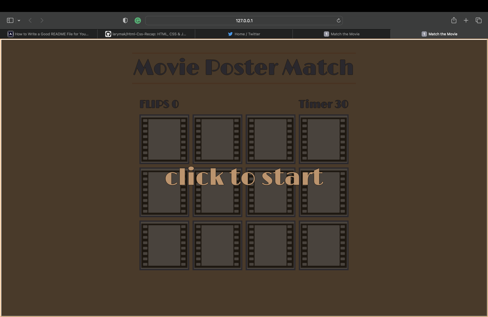
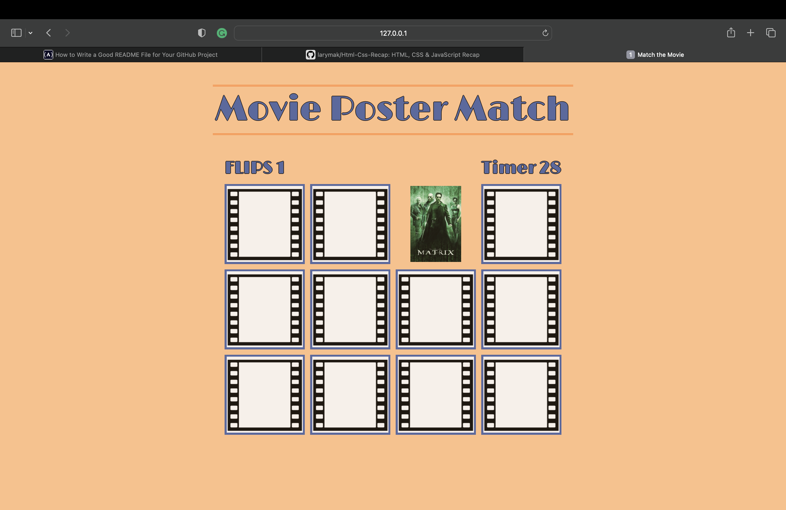
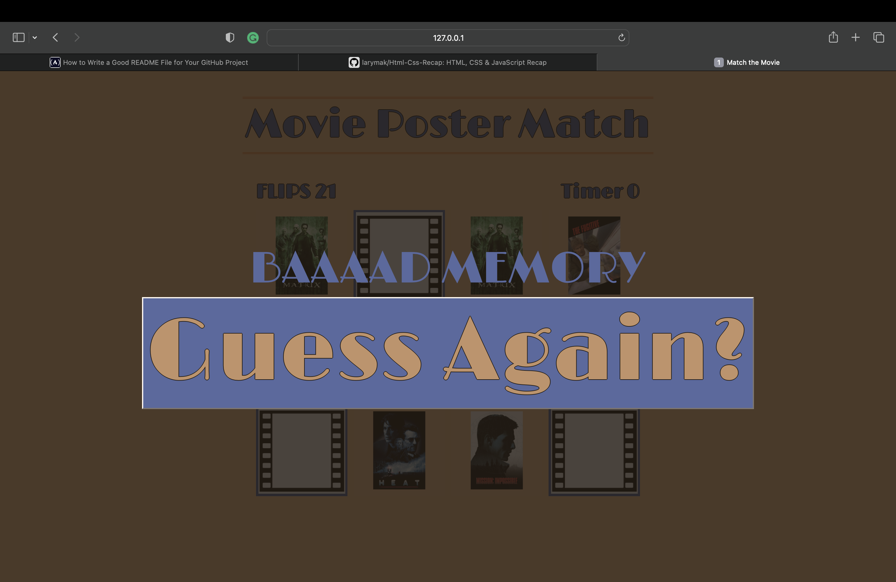
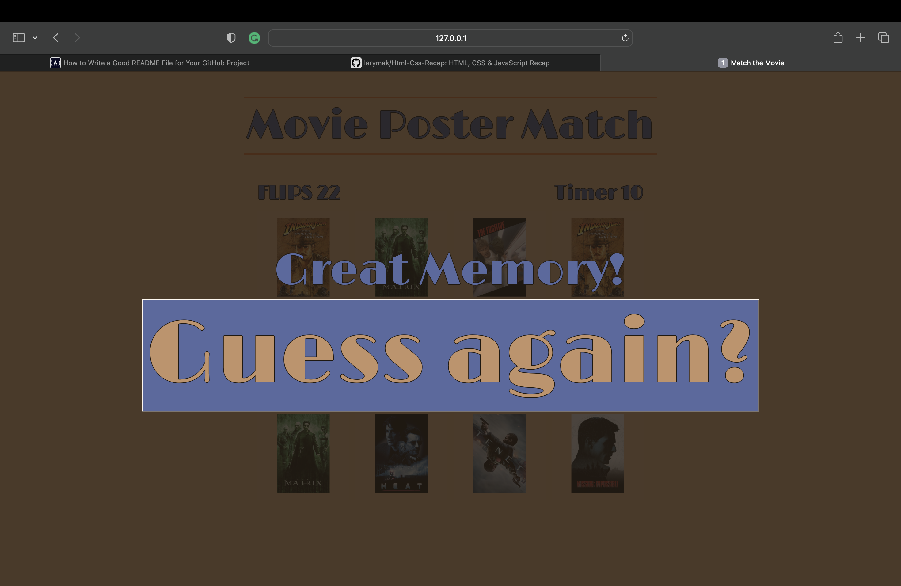

# **Movie Poster Match**

## **OVERVIEW:** 

Welcome! This project uses Git to create a file tree that is comprimsed of CSS, HTML, and Javascript to create a simple browser game. The HTML file will link to CSS and add gameplay functionality via Javascript. 

## **Game Description:** 

Test your memory by matching the movie poster with itself. You want to find the matches. When you click one of the tiles, it flips over to reveal itself. When you click a second, it checks to see if it is a match. If it is, they stay visible, if not, both turn back over. Can you remember where the tile was? Click to start. 

## **Motivation:**

Create a browser game that uses JavaScript to power a CSS designed HTML file. 


## **Screenshots:**

## **When you open the web page you get:**



## **Then, after clicking a square you get:.**



## **When you run out of time:**



## **when you get all the matches:**




 ## **Technologies Used:**


HTML: Using divs for the card and sub divs to hold both the front and back of the card within. 
CSS: When JS adds 'visisible' class, it's the CSS function that rotates the card from back to front and vice versa
JS: Assembling the card class into an array and calling that into a new Class that carries functionality to allow user to flip cards and for the game to check if the card is a match. 

 **This ready function serves to transition the HTML elements into a Javascript ready array format to be used for multiple functions.**

``` Javascript

function ready() {
    let cards = Array.from(document.getElementsByClassName('card'));
    let game = new MixorMatch(cards);
     game.startGame();
    cards.forEach(card=> {
        card.addEventListener('click', ()=> {
                game.flipCard(card);
        })
    })
}

```

 Below is a focal point for the game, showing what happens when a card is flipped. 

``` Javascript

flipCard(card){
    if(this.canFlipCard(card)){
            this.totalClicks++;
            this.ticker.innerText = this.totalClicks;
                card.classList.add('visible');
    
         if(this.cardToCheck)
                    this.checkForCardMatch(card);
      
           else 
                        this.cardToCheck = card;     
            }
    }

```
**Below shows how the game checks for progression**

``` Javascript 

checkForCardMatch(card){
        if(this.getCardType(card)===this.getCardType(this.cardToCheck))
            this.cardMatch(card, this.cardToCheck);
        else
            this.cardMisMatch(card, this.cardToCheck);

    getCardType(card){
        return card.getElementsByClassName('card-value')[0].src;

    }

 ```   

 ``` CSS


.card.visible .card-back{
    transform: rotateY(-180deg);
}

.card.visible .card-front{
    transform: rotateY(0deg);
}

```

## **Play now:**

https://majestic-griffin-87055a.netlify.app/

## **Next Steps:** 
- Include countdown clock to make more difficult
- create instructional h2 window to direct user on how to play
- create option for different movie themes
- add sound effects(depending on movie genre)

## **References:**
- https://www.youtube.com/watch?v=28VfzEiJgy4
- https://www.youtube.com/watch?v=3uuQ3g92oPQ&t=0s


