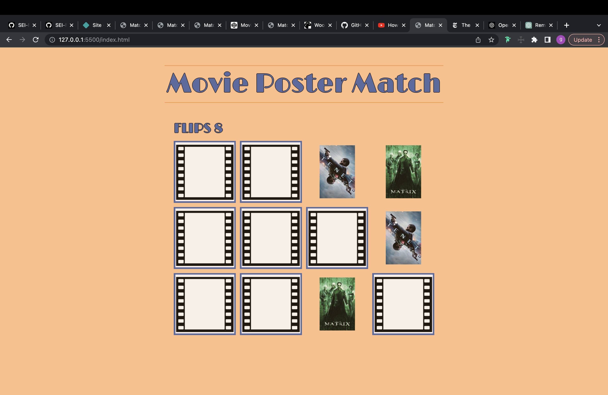
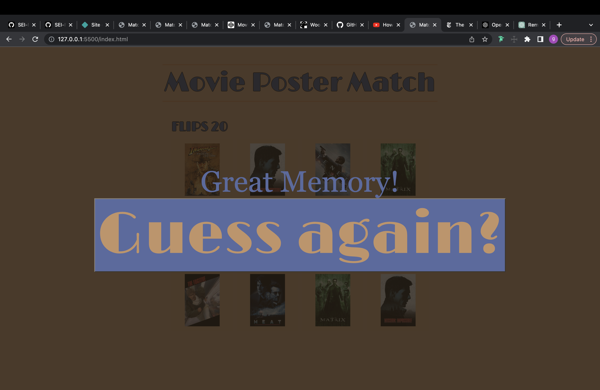

Movie Poster Match!

Descript: Test your memory by matching the movie poster with itself. You want to find the matches. When you click one of the tiles, it flips over to reveal itself. When you click a second, it checks to see if it is a match. If it is, they stay visible, if not, both turn back over. Can you remember where the tile was? Click to start. 

Screenshots

When you open the web page you get:

Then, after clicking you get blank board. 

Tiles reveal themself when clicked:

Stay revealed when matched:

The board gets filled in:

And when you get all the titles you get: 

After click guess again you start over:

☐ Technologies Used: List of the technologies used, e.g., JavaScript, HTML, CSS...

HTML: Using divs for the card and sub divs to hold both the front and back of the card within. 
CSS: creating .visible properties for when the card is revealed and how to reveal it. 
JS: 

cardMatch(card1, card2){
        this.matchedCards.push(card1);
        this.matchedCards.push(card2);
        card1.classList.add('matched');
        card2.classList.add('matched');
        if(this.matchedCards.length=== this.cardsArray.length)
            this.victory();
    }

cardMisMatch(card1, card2){
        this.busy = true; 
            setTimeout(() => {
                card1.classList.remove('visible');
                card2.classList.remove('visible');
                this.busy=false;
                
            }, 1000);

    }

☐ Play now: https://majestic-griffin-87055a.netlify.app/

☐ Next Steps: 
-Include countdown clock to make more difficult
-create instructional h2 window to direct user on how to play
-create option for different movie themes
-add sound effects(depending on movie genre)

