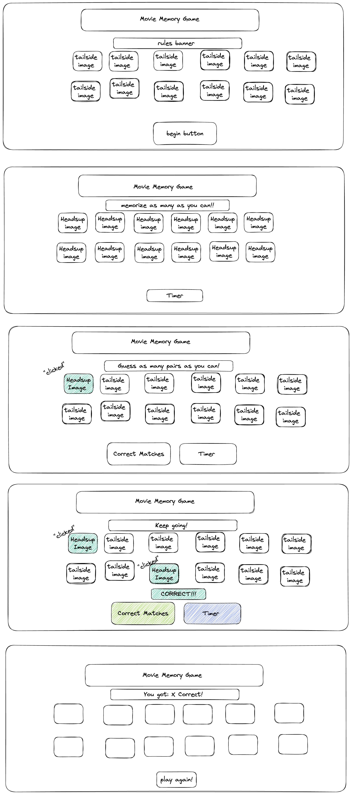

MEMORY CARD GAME

Project Description

My app is called Movie Memory game. It's a game app for players who want to test their memory skills. A player can join an online game and play a round, with the score being kept automatically and game results displayed at then end of a round -- however many successful matches the players gets within the alloted time. Users will have the option to play again. The round will begin with a set time to memorize as many of the cards as possible and then the player will have a selection cycle where they choose two cards in hopes of getting it correct. After two have been selected, they both turn back over. 

Wire Frames

User Stories

    MVP Goals
    * As a player, I want my game to recognize how many correct matches I can make within a certain time frame. 
     
    * As a player, I would like to be informed with some indication when I click a game box so that I know my selection worked.
    * As a player I would like to be able to restart the game after time has expired.
    * As a player, I would the the game to record when I match two panels. 
    * As a player, I would like a round to reset after two click of panels. 

    Stretch Goals
    * As a player, I would like to change the amount of time per round to make it easier or more difficult. 
    * As a player I would like to change the amount of squares in a round, to make it easier or more difficult. 
    *As a player, I would like to change the movie genre of the cards. 
    * As a player, I want my game to inform me when the game is over due to the clock   running out of time. 
    * As a player, I would like my game to begin with a set time to see all the cards  and memorize as many as possible before running out.
    *Use API's to improve animation, 
    *Re-Randomize the images when you play again
    Tech to Use
    * Flexbox/Grid
    * Set Timeout's 
    * Download Images 
    * 